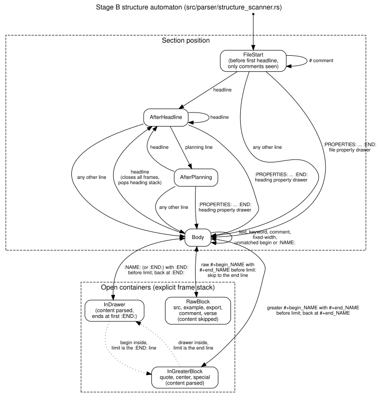

#+TITLE: Documentation
#+STARTUP: showall

This directory separates user references, machine-readable contracts, contributor architecture, and design work.

* User documentation

- [[./cli.org][CLI Reference]] describes each ~orgfdb~ command and its options.
- [[./config.org][Configuration Reference]] describes every supported TOML key.
- [[./reference/query-language.org][Structural Query Language]] describes structural query syntax and matching semantics.
- [[./reference/query-json.org][Query JSON Contract]] describes the stable ~orgfdb query --format json~ response.
- [[./reference/sqlite-schema.org][SQLite Schema]] orients direct SQL users; ~sql/schema.sql~ is authoritative.
- [[./reference/presentation.org][Presentation Output Reference]] describes ~PresentationSpec~, ~presentation-json~, and the registered-view client boundary.

Use these documents when you use ~orgfdb~ or build a client for its current public interfaces.

* Contributor documentation

- [[./architecture.org][Architecture]] describes the current implementation at a high level.
- [[./design/incremental-indexing.org][Incremental Indexing]] describes source discovery and reconciliation contracts.
- [[./design/index-generations-and-changes.org][Index Generations and Changes]] describes committed generations and affected-file deltas.
- [[./design/parser-risks.org][Parser Risks]] records known parser differences and risk decisions, and how to run the local Emacs reference comparison.
- [[./design/line-scanner.org][Line Scanner]] describes the own line lexer, structure scanner and inline scanner that replaced Orgize (#41, done), with its state diagram .
- [[./performance-baseline.org][Performance Baseline]] records historical benchmark measurements. The benchmark code was removed in #114.
- [[./presentation-performance.org][Presentation Performance Benchmarks]] records historical presentation measurements. The benchmark code was removed in #114.
- [[./query-sql-performance.org][Query SQL Performance]] records the query SQL audit, optimizations, and historical SQL measurements.

These documents describe implementation boundaries or detailed internal contracts.

* Documentation ownership

Use one primary document for each public fact.

- Put command flags and command behavior in ~docs/cli.org~.
- Put TOML keys and defaults in ~docs/config.org~.
- Put structural query syntax in ~docs/reference/query-language.org~.
- Put query JSON fields and include-controlled output in ~docs/reference/query-json.org~.
- Put presentation specification and wire semantics in ~docs/reference/presentation.org~.
- Put current module boundaries in ~docs/architecture.org~.
- Put future architecture in a file under ~docs/design/~ and mark it as planned.

The root ~README.org~ stays short. It links to these references instead of duplicating them.
