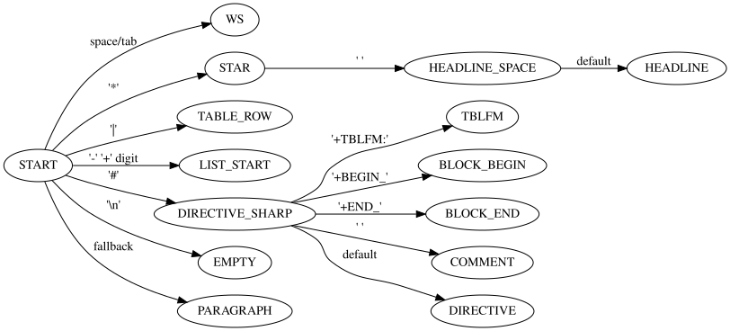

#+TITLE: Lexer Design
#+STARTUP: content

This document describes the Finite State Machines (FSM) used in the Org-Mode
parser. The parsing is divided into two stages:

1. Line Lexer - classifies each input line
2. Inline Lexer - identifies inline structures used for links

* Line Lexer

The Line Lexer classifies each line into one of several Org-Mode structural
types, without performing deeper parsing.

** Purpose

- Fast, character-by-character line recognition
- No backtracking
- Decides the high-level type of each line
- Inline parsing is handled separately

** Recognized Line Types

- Headline: /^*+ /
- Plain List Item: /^([+-]|\d+[.)]) /
- Drawer Start: /^:[A-Z_]+:/
- Drawer End: /^:END:/
- Block Begin: /^#\+BEGIN_.*/
- Block End: /^#\+END_.*/
- Comment: /^# .*/
- Directive: /^#\+.*/
- Table Row: /^\|.*$/
- Table Rule: /^\|[-+]+[|]?$/   (separator lines)
- Table Formula (tblfm): /^#\+TBLFM:/
- Empty Line
- Paragraph (fallback)

** Notes on Tables

All table rows (header rows and normal rows) are treated the same:

- =table-row= → any line beginning with `|`
- =table-rule= → separator lines made of `-|+` patterns
- =tblfm= → table formula lines starting with `#+TBLFM:`

Only inline links should be parsed inside table rows.

Example:

| Student  | Maths | Physics | Mean |
|----------+-------+---------+------|
| Bertrand |    13 |      09 |   11 |
| Henri    |    15 |      14 |      |
| Arnold   |    17 |      13 |      |
#+TBLFM: @2$4=vmean($2..$3)

** State Machine (Description)

States:

- START
- WS (leading whitespace)
- STAR (headline stars)
- HEADLINE_SPACE
- TABLE_ROW
- TABLE_RULE
- LIST_START
- DIRECTIVE_SHARP
- BLOCK_BEGIN
- BLOCK_END
- DRAWER_START
- DRAWER_END
- COMMENT
- EMPTY
- PARAGRAPH
- TBLFM

** Transitions (Simplified Overview)

- START → WS : space/tab
- START → STAR : '*'
- START → TABLE_ROW : '|'
- START → DIRECTIVE_SHARP : '#'
- START → LIST_START : '-', '+', digit
- DIRECTIVE_SHARP → TBLFM : '+TBLFM:'
- DIRECTIVE_SHARP → BLOCK_BEGIN : '+BEGIN_'
- DIRECTIVE_SHARP → BLOCK_END : '+END_'
- DIRECTIVE_SHARP → COMMENT : ' '
- START → PARAGRAPH : fallback

** Graphviz Diagram

#+begin_src dot :file ./img/line_lexer_fsm.svg :cmdline -Tsvg
  digraph line_lexer {
      rankdir=LR;

      START -> WS            [label="space/tab"];
      START -> STAR          [label="'*'"];
      STAR -> HEADLINE_SPACE [label="' '"];
      HEADLINE_SPACE -> HEADLINE [label="default"];

      START -> TABLE_ROW     [label="'|'"];
      START -> LIST_START    [label="'-' '+' digit"];

      START -> DIRECTIVE_SHARP [label="'#'"];
      DIRECTIVE_SHARP -> TBLFM        [label="'+TBLFM:'"];
      DIRECTIVE_SHARP -> BLOCK_BEGIN  [label="'+BEGIN_'"];
      DIRECTIVE_SHARP -> BLOCK_END    [label="'+END_'"];
      DIRECTIVE_SHARP -> COMMENT      [label="' '"];
      DIRECTIVE_SHARP -> DIRECTIVE    [label="default"];

      START -> EMPTY         [label="'\\n'"];
      START -> PARAGRAPH     [label="fallback"];
  }
#+end_src

#+RESULTS:

** Examples
#+begin_example

* Headline
** Subheadline
- List item
| cell | value |
|------+--------|
| link [[https://gnu.org][GNU]] inside |
#+TBLFM: @2$4=vmean($2..$3)
#+END_SRC
#+end_example

---

* Inline Lexer (Inside Line)
The Inline Lexer processes the content of a line, identifying structures such as
links and markup.

This document focuses on the Link Inline FSM.

** Purpose
- Detects and extracts Org-Mode links ([[target][description]])
- Handles escaped characters
- Accepts nested or complex descriptions
- Does not require backtracking
- Works inside any line type (including table rows)

** Link Recognition Rules
- Link starts with =[[=
- Link ends with =]]= (but =]= may appear inside)
- Escape sequences: \[, \]

** States
- START
- OPEN1
- OPEN2
- TARGET
- TARGET_END
- DESC_OPEN
- DESC
- DESC_END
- CLOSE1
- CLOSE2

** Transitions (Simplified)
- START → OPEN1 : '['
- OPEN1 → OPEN2 : '['
- OPEN2 → TARGET
- TARGET → TARGET_END : ']'
- TARGET_END → DESC_OPEN : '['
- DESC_OPEN → DESC
- DESC → DESC_END : ']'
- DESC_END → CLOSE1 : ']'
- CLOSE1 → CLOSE2 : ']'
- CLOSE2 → START

** Graphviz Diagram
#+begin_src dot :file inline_link_fsm.svg :cmdline -Tsvg
digraph inline_link {
    rankdir=LR;

    START -> OPEN1        [label="'['"];
    OPEN1 -> OPEN2        [label="'['"];
    OPEN2 -> TARGET       [label="default"];

    TARGET -> TARGET_END  [label="']'"];
    TARGET_END -> DESC_OPEN [label="'['"];

    DESC_OPEN -> DESC     [label="default"];
    DESC -> DESC_END      [label="']'"];
    DESC_END -> CLOSE1    [label="']'"];
    CLOSE1 -> CLOSE2      [label="']'"];
    CLOSE2 -> START       [label=""];
}
#+end_src

** Examples
#+begin_example
[[https://gnu.org][GNU]]
[[file:~/path with spaces/][Test]]
[[./test.org]]
[[https://test.com][[]nested[] description[]]]
| table | with a [[https://link.com][link]] |
#+end_example

---

* TODO
- FSM for markup: bold, italic, verbatim, code
- FSM for footnotes
- FSM for entities
- Automatic generation of DOT files from Rust
