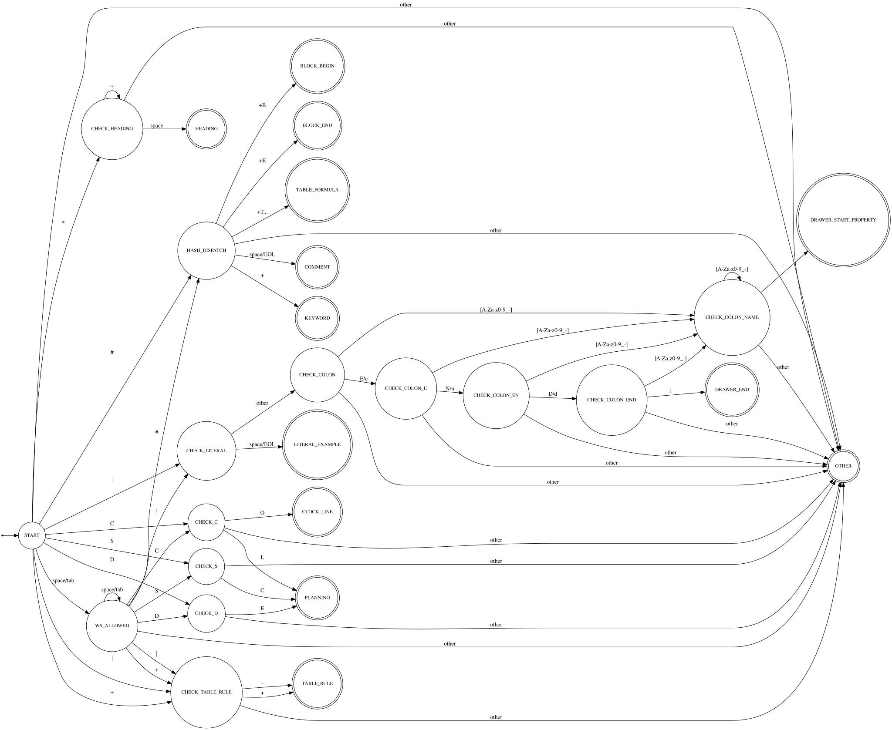

#+TITLE: Lexer Design
#+STARTUP: content

This document describes the Finite State Machines (FSM) used in the Org-Mode
parser.

The parsing is divided into two stages:

1. Line Lexer - classifies each input line
2. Inline Lexer/Parser - identifies inline structures used for links and citations

* Line Lexer

The Line Lexer classifies each line into one of several Org-Mode structural
types, without performing deeper parsing.

** Recognized Line Types

The lexer only recognizes lines that matter for the purpose of this parser.

- Heading
- Comment
- Literal Example
- Keywords
- Block Begin
- Block End
- Planing Line
- Table Formula
- Table Rule

** Rules for Detecting Line Types

*** DONE Heading Line

**** Rule

A heading line introduces an outline node by starting with one or more asterisks.

: **** TODO [#A] Title [2/5] :tag1:tag2:

Regular Expression:

: ^\(\*+\)\(?: +\(.*?\)\)?[ \t]*$

Properties:

- The line must start with one or more ~*~ characters.
- After the stars, at least one normal space is required.  
  Tabs are not allowed in this position.
- An optional title may follow, which may include:
  - TODO keyword
  - priority cookie (e.g. ~[#A]~)
  - statistics cookie (e.g. ~[50%]~, ~[2/3]~)
  - tags (e.g. ~:tag1:tag2:~)
- Trailing spaces or tabs at the end of the line are allowed.

**** Extraction

- line type = heading :: The lexer classification for this line.
- level :: The heading level, determined by counting the number of leading ~*~ characters.  
- raw_text :: The unmodified text following the mandatory space after the stars, up to but not including any trailing whitespace. This includes TODO keyword, priority, statistics cookies, and tags exactly as written.
- begin :: The byte offset of the first character of the line (inclusive).
- end :: The byte offset immediately after the last character of this line  
  (exclusive).
- line_number :: The physical line number in the input buffer (starting at 1).
  
**** Examples:

- level: 1, raw_text: "Heading"
  #+BEGIN_SRC org
    ,* Heading
  #+END_SRC

- level: 3, raw_text: "TODO Something"
  #+BEGIN_SRC org
    ,***   TODO Something
  #+END_SRC

- level: 4, raw_text: "TODO [#A] Title [0/0] :tag1:tag2:"
  #+BEGIN_SRC org
    ,**** TODO [#A] Title [2/5] :tag1:tag2:
  #+END_SRC

*** DONE Comment Line

**** Rule

A comment line designates a line that is ignored by Org and begins with a hash mark.

: # a comment line

Regular Expression:

: ^[ \t]*#\(?: \|$\)

Properties:

- Optional leading spaces or tabs are allowed.
- Followed by ~#~.
- Immediately after ~#~ must be either:
  - a single space, or
  - end of line.

**** Extraction

- line type = example line :: The lexer classification for this line.
- begin :: The byte offset of the first character of the line (inclusive).
- end :: The byte offset immediately after the last character of this line  
  (exclusive).
- line_number :: The physical line number in the input buffer (starting at 1).

**** Examples

#+BEGIN_SRC org
  # Comment
      # another comment
  #
  # 
#+END_SRC

*** DONE Literal Example Line

**** Rule

A literal example line introduces fixed-width text beginning with a colon.

: This actually is a literal example.

Regular Expression:

: ^[ \t]*: \( \|$\)

Properties:

- A literal example (fixed-width) line starts with optional leading spaces or tabs.
- Followed by a single colon `:`.
- Immediately after the colon must be **either**:
  - a single space (`: `), or
  - end of line (`:`).

**** Extraction

- line type = example line :: The lexer classification for this line.
- begin :: The byte offset of the first character of the line (inclusive).
- end :: The byte offset immediately after the last character of this line  
  (exclusive).
- line_number :: The physical line number in the input buffer (starting at 1).

**** Examples

#+BEGIN_SRC org
  : literal line
      : indented literal line
  :
  :
#+END_SRC

*** DONE Keyword Line

**** Rule

A keyword line declares an Org-Mode keyword beginning with ~#+~ and followed by a name, a colon and optional value.

: #+TITLE: My Document

Regular Expression:

: ^[ \t]*#\+\(\S-+?\):[ \t]*\(.*\)$

Properties:

- A keyword line starts with optional leading spaces or tabs.
- Followed by ~#+~.
- The keyword name consists of one or more non-whitespace characters and ends with a colon ~:~.
- After the colon, any amount of spaces or tabs may follow.
- The rest of the line is taken as the keyword value (as-is).
- Org converts the keyword name to uppercase, so the lexer should store it uppercased.

Notes:

- The value may be empty (e.g., ~#+KEY:~).
- No deeper parsing is done at this stage; the entire trailing text is considered the value.
- Whether a keyword is affiliated or standalone is handled later by the parser. For the Line Lexer, every ~#+KEY:~ line is simply a keyword line.

**** Extraction

- line type = keyword :: The lexer classification for this line.
- name :: The keyword name, taken from the text between `#+` and the colon. It is always stored uppercased (e.g., `TITLE`, `OPTIONS`, `HTML_HEAD`).
- value :: The raw keyword value appearing after the colon. Leading spaces after the colon are trimmed. The value may be empty (e.g., `#+KEY:` → `value = ""`).
- begin :: The byte offset of the first character of the line (inclusive).
- end :: The byte offset immediately after the last character of this line  
  (exclusive).
- line_number :: The physical line number in the input buffer (starting at 1).

**** Examples

- name: "TITLE", value: "My Document"
  #+BEGIN_SRC org
    ,#+TITLE: My Document
  #+END_SRC

- name: "AUTHOR", value: "John Doe"
  #+BEGIN_SRC org
    ,#+AUTHOR:John Doe
  #+END_SRC

- name: "AUTHOR", value: "John Doe"
  #+BEGIN_SRC org
    ,#+AUTHOR:          John Doe
  #+END_SRC

- name: "AUTHOR", value:"" 
  #+BEGIN_SRC org
    ,#+AUTHOR:
  #+END_SRC

- name: "OPTIONS", value: "toc:nil num:t"
  #+BEGIN_SRC org
            ,#+options: toc:nil num:t
  #+END_SRC

*** DONE Drawer End Line

**** Rule

A drawer end line closes a drawer block. It consists of the keyword ~:END:~ optionally preceded or followed by whitespace.

Regular Expression:

: ^[ \t]*:END:[ \t]*$

Properties:

- Optional leading spaces or tabs are allowed.
- The line must contain exactly the drawer end marker ~:END:~.
- Trailing spaces or tabs at the end of the line are allowed.

Notes:

- The lexer does not check whether a corresponding drawer-begin line exists.
  Matching drawer structure is handled later by the parser.

**** Extraction

- line type = drawer end :: The lexer classification for this line.
- begin :: The byte offset of the first character of the line (inclusive).
- end :: The byte offset immediately after the last character of this line  
  (exclusive).
- line_number :: The physical line number in the input buffer (starting at 1).

**** Examples

#+BEGIN_SRC org
:END:
#+END_SRC

#+BEGIN_SRC org
    :END:
#+END_SRC

*** DONE Drawer or Property Line

**** Rule

A line of the form ~:NAME:~ is lexically ambiguous in Org syntax. It may represent either the beginning of a drawer block or a property line. At the lexical stage, both forms share the exact same structure:

: :NAME:

Since the distinction depends on structural context (e.g. the presence of a matching ~:END:~ line later in the document), the Line Lexer does not attempt to classify such lines as drawer or property.  This decision is made later by the parser.

Regular Expression:

: ^[ \t]*:\([_[:word:]-]+\):[ \t]*$

Properties:

- Optional leading spaces or tabs are allowed.
- The line must contain:
  - an initial colon (~:~),
  - a non-empty name consisting of letters, digits, underscore, or hyphen,
  - a closing colon (~:~).
- Trailing spaces or tabs at the end of the line are allowed.

**** Extraction

- line type = drawer-or-property :: A colon-definition line recognized by the lexer.
- name :: The uppercased drawer or property name appearing between the two colons.
- begin :: The byte offset of the first character of the line (inclusive).
- end :: The byte offset immediately after the last character of the line  
  (exclusive).
- line_number :: The physical line number in the input buffer (starting at 1).

**** Examples

- name: "PROPERTIES"
  #+BEGIN_SRC org
    :PROPERTIES:
  #+END_SRC

- name: "LOGKBOOK"
  #+BEGIN_SRC org
    :logbook:
  #+END_SRC

- name: "ARCHIVE"
  #+BEGIN_SRC org
    :ARCHIVE:  a
  #+END_SRC

- name: "ARCHIVE"
  #+BEGIN_SRC org
    :ARCHIVE:
  #+END_SRC

*** DONE Block Begin Line

**** Rule

A block containing a special environment like source code or examples ist started with a special begin line and ended with a special end line.

: #+BEGIN_SRC rust

Regular Expression:

: ^[ \t]*#\+begin_?\([^ \t]+\)\(?:[ \t]+\(.*\)\)?[ \t]*$

Properties:

- Optional leading spaces or tabs are allowed.
- A block begin line starts with ~#+BEGIN_~, case-insensitive.
- The block name consists of one or more non-whitespace characters.
- After the block name, optional arguments may follow. Arguments are kept as raw text.
- Trailing spaces or tabs at the end of the line are allowed.

Notes:

- The Line Lexer does not match or validate the corresponding ~#+END_~ line.
- The lexer does not inspect or parse arguments syntax.

**** Extraction

- line type = block begin :: The lexer classification for this line.
- name :: The block name appearing after ~#+BEGIN_~ (or ~#+begin_~),  
  normalized to uppercase.
- raw_args :: The full unparsed argument string appearing after the block name. This includes language, switches, and all header parameters verbatim.  
  No semantic parsing is done at the line-lexer stage.
- begin :: The byte offset of the first character of the line (inclusive).
- end :: The byte offset immediately after the last character of the line (exclusive).
- line_number :: The physical line number in the input buffer (starting at 1).

**** Examples

- name: "SRC", raw_args: "rust"
  #+BEGIN_SRC org
    ,#+BEGIN_SRC rust
  #+END_SRC

- name: "SRC", raw_args: "emacs-lisp :results value table replace"
  #+BEGIN_SRC org
    ,#+BEGIN_SRC emacs-lisp :results value table replace
  #+END_SRC

- name: "EXAMPLE", raw_args: ""
  #+BEGIN_SRC org
    ,#+begin_example
  #+END_SRC

*** DONE Block End Line

**** Rule

A block containing a special environment like source code or examples ist started with a special begin line and ended with a special end line.

: #+END_SRC

Regular expression:

: ^[ \t]*#\+end_?\([^ \t]+\)[ \t]*$

Properties:

- Optional leading spaces or tabs are allowed.
- A block end line starts with ~#+END_~ or ~#+end_~, case-insensitive.
- The block name consists of one or more non-whitespace characters.
- Trailing spaces or tabs at the end of the line are allowed.

Notes:

- Only the end line is recognized — the Line Lexer does not verify
  that the block name matches a preceding ~#+BEGIN_~ line.

**** Extraction

- line type = block end :: The lexer classification for this line.
- name :: The block name appearing after ~#+END_~ (or ~#+end_~),  
  normalized to uppercase.
- begin :: The byte offset of the first character of the line.
- end :: The byte offset immediately after the last character of the line.
- line_number :: The physical line number in the input buffer (starting at 1).

**** Examples

- name: "SRC"
  #+BEGIN_SRC org
    ,#+END_SRC
  #+END_SRC

- name: "EXPORT"
  #+BEGIN_SRC org
    ,#+end_export
  #+END_SRC

- name: "EXAMPLE"
  #+BEGIN_SRC org
    ,#+end_example
  #+END_SRC

*** DONE Planning Line

**** Rule

A planning line contains one or more planning keywords at the start of the line:

- CLOSED:
- DEADLINE:
- SCHEDULED:

Regular expression:

: ^[ \t]*\(\(?:CLOSED\|DEADLINE\|SCHEDULED\):\)

Properties:

- Optional leading spaces or tabs are allowed.
- The line must begin with at least one planning keyword (~CLOSED~, ~DEADLINE~, ~SCHEDULED~).
- A planning keyword is always followed by a colon (~CLOSED:~, ~DEADLINE:~, ~SCHEDULED:~).
- The timestamps after the planning keyword. The line lexer does not interpret or parse them — it simply returns the entire line as raw text. Extracting individual timestamps is the job of the parser stage.
- Multiple planning keywords may appear on the same line.

**** Extraction

- line type = planning :: The lexer classification for this line.
- raw_text :: The entire line after trimming trailing whitespace.  
  This includes all planning keywords and timestamps exactly as written.
- begin :: The byte offset of the first character of the line (inclusive).
- end :: The byte offset immediately after the last character of the line (exclusive).
- line_number :: The physical line number in the input buffer (starting at 1).

**** Examples

- raw_text: "CLOSED: [2024-11-05 Tue]"
  #+BEGIN_SRC org
    CLOSED: [2024-11-05 Tue]
  #+END_SRC

- raw_text: "DEADLINE: <2024-11-10 Sun>"
  #+BEGIN_SRC org
    DEADLINE: <2024-11-10 Sun>
  #+END_SRC

- raw_text: "SCHEDULED: <2025-01-01 Wed>"
  #+BEGIN_SRC org
        SCHEDULED: <2025-01-01 Wed>
  #+END_SRC

- raw_text: "DEADLINE: <2024-12-01 Sun> SCHEDULED: <2024-11-20 Wed>"
  #+BEGIN_SRC org
    DEADLINE: <2024-12-01 Sun> SCHEDULED: <2024-11-20 Wed>
  #+END_SRC

*** DONE Clock Line

**** Rule

A clock line records timestamp information in Org-Mode and begins with the literal keyword ~CLOCK:~. It may occur inside drawers (commonly in `LOGBOOK` or `CLOCK` drawers) or standalone.

Regular Expression:

: ^[ \t]*CLOCK:

Properties:

- Optional leading spaces or tabs are allowed.
- The keyword ~CLOCK:~ is case-insensitive.
- Everything following ~CLOCK:~ is raw clock data.

**** Extraction

- line type = clock line :: The lexer classification for this line.
- raw_text :: The full line content after trimming trailing whitespace.
- begin :: Byte offset (inclusive).
- end :: Byte offset (exclusive).
- line_number :: Physical line number (1-based).

**** Examples

- raw_text: "[2024-01-02 Tue 22:33]--[2024-01-02 Tue 23:48] => 1:15"
  #+BEGIN_SRC org
    CLOCK: [2024-01-02 Tue 22:33]--[2024-01-02 Tue 23:48] => 1:15
  #+END_SRC

- raw_text: "[2024-01-05 Fri 13:05]"
  #+BEGIN_SRC org
      CLOCK: [2024-01-05 Fri 13:05]
  #+END_SRC

*** DONE Table Formula Line

**** Rule

A table formula line defines spreadsheet formulas associated with an Org table.

Regular Expression:

: ^[ \t]*#\+TBLFM:

Properties:

- Optional leading spaces or tabs are allowed.
- The line must contain the keyword ~#+TBLFM:~ (case-insensitive).
- Everything following the colon belongs to the formula expression.
- The Line Lexer does **no** interpretation of the formula syntax;  
  it simply returns the raw formula part of the line.

Notes:

- A table formula line always starts with ~#+TBLFM:~, never with a pipe (~|~).
- The lexer only needs to detect that it is a table formula line. Nothing has to be returned as those lines can be ignored.

**** Extraction

- line type = table formula :: The lexer classification for this line.
- begin :: The byte offset of the first character of the line (inclusive).
- end :: The byte offset immediately after the last character of the line (exclusive).
- line_number :: The physical line number in the input buffer (starting at 1).

**** Examples

#+BEGIN_SRC org
  ,#+TBLFM: @2$4=vmean($2..$3)
  ,#+TBLFM: $3='(+ $1 $2)
  ,  #+TBLFM: :: @3$2=vsum(@1$2..@2$2)::@>$3='(* @I @II)
#+END_SRC

*** DONE Table Rule Line

**** Rule

A table rule line is a horizontal separator inside a table.

Regular Expressions:

- Org-style hline  
  : ^[ \t]*|-

- table.el-style hline  
  : ^[ \t]*\+-[-+]

Properties:

- Optional leading spaces or tabs are allowed.
- An Org table rule begins with a pipe (~|~) followed by one or more hyphens.
- A `table.el` table rule begins with a `+` and consists of a combination  
  of `+` and `-` characters.

Notes:

- Rule lines do not contain data cells.
- They separate header rows from body rows or cell groups.
- The lexer does not return any structural details besides the classification.

**** Extraction

- line type = table rule :: The lexer classification for this line.
- begin :: The byte offset of the first character of the line (inclusive).
- end :: The byte offset immediately after the last character of the line (exclusive).
- line_number :: The physical line number in the input buffer (starting at 1).

**** Examples

#+BEGIN_SRC org
  |-----
  |----+------|
    |-----+----+---|
  +---+---+---+
    +-----+-----+
#+END_SRC

** FSM Finite State Machine

*** State Diagram

#+BEGIN_SRC dot :file ./img/line_lexer_fsm.svg :cmdline -Tsvg
  digraph OrgLexerDFA {
      rankdir=LR;
      node [shape=circle, fontsize=12];

      START [shape=circle];
      OTHER [shape=doublecircle];

      HEADING [shape=doublecircle];
      COMMENT [shape=doublecircle];
      LITERAL_EXAMPLE [shape=doublecircle];
      KEYWORD [shape=doublecircle];
      BLOCK_BEGIN [shape=doublecircle];
      BLOCK_END [shape=doublecircle];
      PLANNING [shape=doublecircle];
      TABLE_FORMULA [shape=doublecircle];
      TABLE_RULE [shape=doublecircle];

      DRAWER_START_PROPERTY [shape=doublecircle];
      DRAWER_END [shape=doublecircle];
      CLOCK_LINE [shape=doublecircle];

      CHECK_HEADING [shape=circle];
      WS_ALLOWED [shape=circle];
      HASH_DISPATCH [shape=circle];
      CHECK_LITERAL [shape=circle];

      // colon granularity (fully implemented)
      CHECK_COLON [shape=circle];
      CHECK_COLON_E [shape=circle];
      CHECK_COLON_EN [shape=circle];
      CHECK_COLON_END [shape=circle];
      CHECK_COLON_NAME [shape=circle];

      // planning granularity (NOT fully expanded into all sub-states)
      // NOTE: Full DFA for CLOSED:, DEADLINE:, SCHEDULED:, CLOCK:
      // would require multiple additional states per word (C->CL->CLO->CLOS etc.).
      // This diagram uses a compact placeholder representation.
      CHECK_C [shape=circle];
      CHECK_D [shape=circle];
      CHECK_S [shape=circle];

      CHECK_TABLE_RULE [shape=circle];

      entry [shape=point];
      entry -> START;

      // START transitions
      START -> CHECK_HEADING [label="*"];
      START -> WS_ALLOWED [label="space/tab"];
      START -> HASH_DISPATCH [label="#"];
      START -> CHECK_LITERAL [label=":"];
      START -> CHECK_C [label="C"];
      START -> CHECK_D [label="D"];
      START -> CHECK_S [label="S"];
      START -> CHECK_TABLE_RULE [label="|"];
      START -> CHECK_TABLE_RULE [label="+"];
      START -> OTHER [label="other"];

      // Whitespace allowed
      WS_ALLOWED -> WS_ALLOWED [label="space/tab"];
      WS_ALLOWED -> HASH_DISPATCH [label="#"];
      WS_ALLOWED -> CHECK_LITERAL [label=":"];
      WS_ALLOWED -> CHECK_C [label="C"];
      WS_ALLOWED -> CHECK_D [label="D"];
      WS_ALLOWED -> CHECK_S [label="S"];
      WS_ALLOWED -> CHECK_TABLE_RULE [label="|"];
      WS_ALLOWED -> CHECK_TABLE_RULE [label="+"];
      WS_ALLOWED -> OTHER [label="other"];

      // Heading
      CHECK_HEADING -> CHECK_HEADING [label="*"];
      CHECK_HEADING -> HEADING [label="space"];
      CHECK_HEADING -> OTHER [label="other"];

      // Literal example or colon-based dispatch
      CHECK_LITERAL -> LITERAL_EXAMPLE [label="space/EOL"];
      CHECK_LITERAL -> CHECK_COLON [label="other"];

      // Colon-based drawer/property detection (fully implemented)
      CHECK_COLON -> CHECK_COLON_E [label="E/e"];
      CHECK_COLON -> CHECK_COLON_NAME [label="[A-Za-z0-9_-]"];
      CHECK_COLON -> OTHER [label="other"];

      CHECK_COLON_E -> CHECK_COLON_EN [label="N/n"];
      CHECK_COLON_E -> CHECK_COLON_NAME [label="[A-Za-z0-9_-]"];
      CHECK_COLON_E -> OTHER [label="other"];

      CHECK_COLON_EN -> CHECK_COLON_END [label="D/d"];
      CHECK_COLON_EN -> CHECK_COLON_NAME [label="[A-Za-z0-9_-]"];
      CHECK_COLON_EN -> OTHER [label="other"];

      CHECK_COLON_END -> DRAWER_END [label=":"];
      CHECK_COLON_END -> CHECK_COLON_NAME [label="[A-Za-z0-9_-]"];
      CHECK_COLON_END -> OTHER [label="other"];

      CHECK_COLON_NAME -> CHECK_COLON_NAME [label="[A-Za-z0-9_-]"];
      CHECK_COLON_NAME -> DRAWER_START_PROPERTY [label=":"];
      CHECK_COLON_NAME -> OTHER [label="other"];

      // Planning lines
      // NOTE: Not fully expanded — in the Rust lexer,
      // CLOSED:, DEADLINE:, SCHEDULED:, CLOCK: will be implemented
      // as complete multi-state chains.
      CHECK_C -> PLANNING [label="L"];       // CLOSED: (placeholder)
      CHECK_C -> CLOCK_LINE [label="O"];     // CLOCK:  (placeholder)
      CHECK_C -> OTHER [label="other"];

      // NOTE: DEADLINE: not expanded into D->DE->DEA->... chain
      CHECK_D -> PLANNING [label="E"];       // DEADLINE: (placeholder)
      CHECK_D -> OTHER [label="other"];

      // NOTE: SCHEDULED: not expanded into S->SC->SCH->...
      CHECK_S -> PLANNING [label="C"];       // SCHEDULED: (placeholder)
      CHECK_S -> OTHER [label="other"];

      // Table rule (correct but compact)
      CHECK_TABLE_RULE -> TABLE_RULE [label="-"];
      CHECK_TABLE_RULE -> TABLE_RULE [label="+"];
      CHECK_TABLE_RULE -> OTHER [label="other"];

      // Hash dispatch
      // NOTE: block-begin/end and keyword detection shown compactly.
      HASH_DISPATCH -> COMMENT [label="space/EOL"];
      HASH_DISPATCH -> TABLE_FORMULA [label="+T..."];   // compact placeholder
      HASH_DISPATCH -> KEYWORD [label="+"];             // NAME:
      HASH_DISPATCH -> BLOCK_BEGIN [label="+B"];        // BEGIN_ / begin_
      HASH_DISPATCH -> BLOCK_END [label="+E"];          // END_ / end_
      HASH_DISPATCH -> OTHER [label="other"];
  }
#+END_SRC

#+RESULTS:

* Inline Lexer (Inside Line)

The Inline Lexer processes the content of a line, identifying structures such as
links and markup. 

I only plan to add Links and Citations.

** DONE Links (Org-Mode) — Lexer/Parser Spec (Bracket, Angle, Plain)
:PROPERTIES:
:CUSTOM_ID: 3aaf24af-52fc-4cf6-9892-128bee8978ff
:END:

*** Assumptions

- We recognize and store only:
  - bracket links: =[[...]]= and =[[...][...]]=
  - angle links: =<type:...>=
  - plain links: =type:path= (no spaces)
- We ignore radio targets / link targets like =<<...>>= and =<<<...>>>=.
- Bracket links may use an *implicit* file type when the target looks like a file path:
  - =[[./lexer-design.org]]=
  - =[[~/.emacs.default]]=
- Description parsing is permissive:
  - In the DESCRIPTION part of a bracket link, any characters may appear (including unescaped =[]= and =]=),
    and “nested-looking” bracket sequences are allowed.
  - The bracket link ends only at the first valid closing delimiter =]]= (same-line, recommended).
- Newlines inside links:
  - Org may allow newlines inside a bracket link description in some situations, but this parser intentionally does NOT parse links across newlines.
  - If a bracket/angle link would require crossing a newline to close, treat it as not-a-link and continue scanning.

*** Custom Link Types (config)

In addition to built-in types, the parser accepts custom link prefixes from configuration:

: custom_link_types = [
:   "gdrive",
:   "def",
:   "jira",
: ]

This affects:
- plain links: =gdrive:...=, =def:...=, =jira:...=
- angle links: =<gdrive:...>=, ...
- bracket links: =[[gdrive:...][...]]=, ...

*** Storage Mapping (DB columns)

Store one row per detected link token:

- file_id :: current file row id (provided by caller)
- heading_id :: current heading context id (resolved by outer parser, may be NULL)
- begin :: byte offset of first character of the link token (inclusive)
- end :: byte offset immediately after last character (exclusive)
- line :: physical line number (1-based) where begin occurs
- format :: =bracket= | =angle= | =plain=
- type :: link type/scheme (e.g. =http=, =https=, =file=, =mailto=, =id=, ...), or =fuzzy=
- path :: main path portion (NOT NULL; may be empty only for degenerate cases like =file:::find me=)
- description :: bracket link description (optional; NULL if absent or for plain/angle)
- search_option :: optional portion after =::= for file-like links
- relation :: optional custom extraction from description (see “Relation”)

Optional resolution fields (filled later):
- path_absolute
- target_file_id
- target_heading_id

*** Link Token Priority (recommended)

Scan left-to-right:

1) If current position starts with =[[=, try parse a Bracket Link.
   - If parsing fails: advance by 1 byte and continue scanning.
     This ensures sequences like =[[[]]][[[[[file:...= still find the first valid link at =[[file:...=.
2) Else if current char is =<=, try parse an Angle Link.
3) Else try parse a Plain Link (=type:path=).
4) Otherwise advance by 1 byte.

--------------------------------------------------------------------------------
*** DONE Bracket Link (Org-Mode =[[...]]= / =[[...][...]]=)

**** Rule

A bracket link is an inline element that starts with =[[=. It always contains a target and may optionally contain a description.

: [[TARGET]]
: [[TARGET][DESCRIPTION]]

**** Validity Rules (important)

- Must start with exact =[[=.
- Must close on the same line (recommended). If a newline is reached before a valid close, it is not a link.
- TARGET rules (strict, Org-like):
  - TARGET ends at the first unescaped delimiter:
    - =]]= ends the link (no description)
    - =][= starts the description
  - Within TARGET, unescaped =[]= and unescaped =]= are NOT allowed.
    - =\[]= and =\]= are allowed.
    - This makes =[[[]]]= invalid (good for your “first valid link starts later” case).
- DESCRIPTION rules (permissive, as requested):
  - If =][= occurred, DESCRIPTION starts immediately after it.
  - DESCRIPTION may contain anything (including unescaped =[]=, =]=, =][=, etc.).
  - The link ends at the first unescaped closing delimiter =]]= (same line),
    where =]]= means *two immediately adjacent* =]= characters.
    - If any character occurs between the two closing brackets, it is NOT a closing delimiter.
    - This matters for “invisible” characters like Zero Width Space (U+200B), which Org commonly
      uses to break syntax while keeping the text visually unchanged.
  - Do NOT treat “almost delimiters” like =] ]= or =] [= inside DESCRIPTION as invalid;
    they are just normal description text unless they form an actual =]]= close.

**** Escaping Rule (odd/even backslashes)

When scanning for delimiter sequences (=]]= or =][=) and when deciding whether a =]= in TARGET is “real”:

- Count consecutive backslashes immediately before the delimiter’s first =]= (or before the =]= character).
- odd count  → escaped → treat as literal character(s)
- even count → not escaped → delimiter / structural character

Notes:
- Org documents explicitly state that backslash escaping is required in the LINK part for some characters
  (notably =\=, =[=, =]=). :contentReference[oaicite:2]{index=2}
- For “breaking” Org syntax in general text, Org recommends using Zero Width Space (U+200B). :contentReference[oaicite:3]{index=3}
  This is relevant for DESCRIPTION when it contains a literal =]]= sequence.

**** Extraction

- token type :: link
- format :: =bracket=
- raw_target :: TARGET text (no outer brackets), still escaped
- raw_description :: DESCRIPTION text (optional)
  - normalization (recommended):
    - store description_raw exactly as in the buffer
    - additionally store / compute description_norm where Unicode format characters used for “breaking”
      (e.g. U+200B) are removed, so displayed text and stored text match better.
- type :: derived from raw_target (see “Target decomposition”)
- path :: derived from raw_target
- search_option :: derived from path for file-like links
- description :: raw_description (or processed text if you strip relation)
- relation :: optional extracted relation
- begin :: byte offset of the first =[=
- end :: byte offset immediately after the final =]]= (exclusive)
- line :: 1-based line number of begin

**** Target Decomposition (type/path + implicit file type)

Given raw_target:

1) Explicit typed target: if raw_target matches =TYPE:REST= where TYPE is recognized (built-in or custom):
   - type = TYPE
   - path = REST
2) Implicit file target inside bracket links:
   - If raw_target starts with one of:
     - =./=, =../=, =~/=, =/= (and optionally Windows drive forms)
   then:
   - type = =file=
   - path = raw_target
   Examples:
   - =[[./lexer-design.org]]=
   - =[[~/.emacs.default]]=
3) Otherwise:
   - type = =fuzzy=
   - path = raw_target
   Example:
   - =[[lexer-design.org][sdf]]= → fuzzy (not file)

**** Search Options for file-like links (=::=)

Applies to type in {=file=, =attachment=, =id=} and implicit file.

If path contains =::=, split at the first occurrence:
- path = part before =::= (may be empty)
- search_option = part after =::= (may be empty)

Examples:
: [[file:~/code/main.c::255]]
: [[file:~/xx.org::*My Target]]
: [[file:~/xx.org::#my-custom-id]]
: [[file:~/xx.org::/regexp/]]
: [[attachment:main.c::255]]
: [[file:::find me]]

**** Relation (custom extension)

If DESCRIPTION contains a relation marker, store it separately.

Recommended simple rule:
- If DESCRIPTION contains =(->RELATION)= (typically near the end):
  - relation = RELATION (trim spaces)
  - description = DESCRIPTION with that marker removed (trim spaces)

Example:
: [[https://www.example.com][Example (->Inhaber)]]

**** Examples

- Target only (typed):
: See [[file:notes.org]] for details.

- Target only (implicit file type):
: See [[./lexer-design.org]] for details.
: See [[~/.emacs.default]] for details.

- With description:
: Open [[https://example.com][Example Site]] now.

- Fuzzy (NOT a file):
: [[lexer-design.org][sdf]]

- Description with unescaped brackets and nested-looking sequences:
: [[https://test.com][[]valid[] [[description[]]

- Literal =]]= inside description without terminating the link (using an invisible breaker):
  (U+200B between the two closing brackets — visually looks like =]]= but is not adjacent)
: [[file:lexer-design.org][Description]​]​ more]]
  → description contains a “]]” visually, link closes at the first *adjacent* =]]= later

- “Garbage before a real link” (real link starts at =[[file:...=):
: [[[]]][[[[[file:lexer-design.org][sd]]

- Newline inside description (ignored by this parser; not parsed as a link):
: [[file:lexer-design.org][s
:      d]]

**** Note on “weird characters” in DESCRIPTION (e.g., zero-width spaces)

Some editors/terminals may display invisible Unicode characters (e.g., a zero-width space) near bracket sequences.
The parser should treat them as normal characters:
- They do not end a link unless they are part of the exact closing delimiter =]]=
- If such a character appears between the two closing brackets, it breaks the delimiter and the link may not close.

--------------------------------------------------------------------------------
*** DONE Angle Link (Org-Mode =<type:...>=)

**** Rule

An angle link is delimited by =<= and =>=:

: <TYPE:PATH>

Spaces are allowed inside PATH. This parser requires the closing =>= on the same line.

**** Validity Rules

- Must start with =<=.
- Must contain a recognized =TYPE:= prefix (built-in or custom).
- Ends at the first =>= on the same line.
- If newline/EOF occurs before =>=, it is not a link.

**** Extraction

- format :: =angle=
- type :: TYPE
- path :: PATH
- description :: NULL
- search_option :: optional =::= split for file-like types
- begin/end/line :: as usual

**** Examples

: See <https://example.com/some path with spaces> now.
: <file:~/code/main.c::255>
: <jira:ABC-123>

--------------------------------------------------------------------------------
*** DONE Plain Link (Org-Mode =type:path= without spaces)

**** Rule

A plain typed link has a URL-like prefix and contains no whitespace:

: TYPE:PATH

**** Validity Rules (pragmatic)

- No whitespace inside the token.
- TYPE must be recognized (built-in or custom).
- PATH continues until whitespace.

**** Extraction

- format :: =plain=
- type :: TYPE
- path :: PATH
- description :: NULL
- search_option :: optional =::= split for file-like types
- begin/end/line :: as usual

**** Examples

: Visit https://example.com now.
: file:./lexer-design.org::#my-custom-id
: mailto:me@example.com
: gdrive:1a2b3c4d

--------------------------------------------------------------------------------
*** DONE Known Types

Built-in types (from your =org-link-types-re= snippet) include:
- attachment, docview, elisp, file (including file+...), ftp
- help, helpful, http, https
- id, info, mailto
- news, nov
- shell, shortdoc, yt

Custom types:
- from =custom_link_types= configuration.

--------------------------------------------------------------------------------

